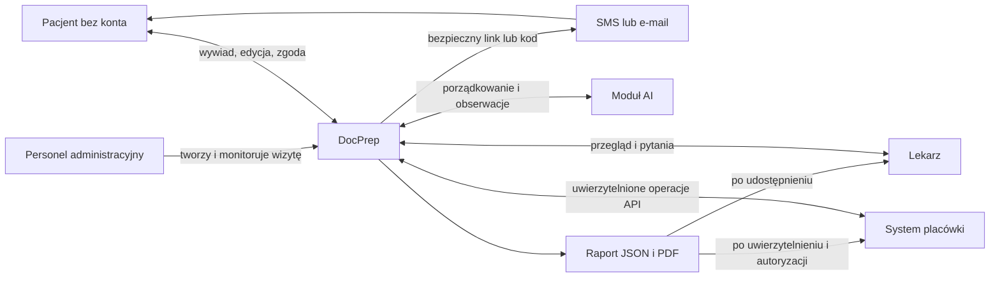
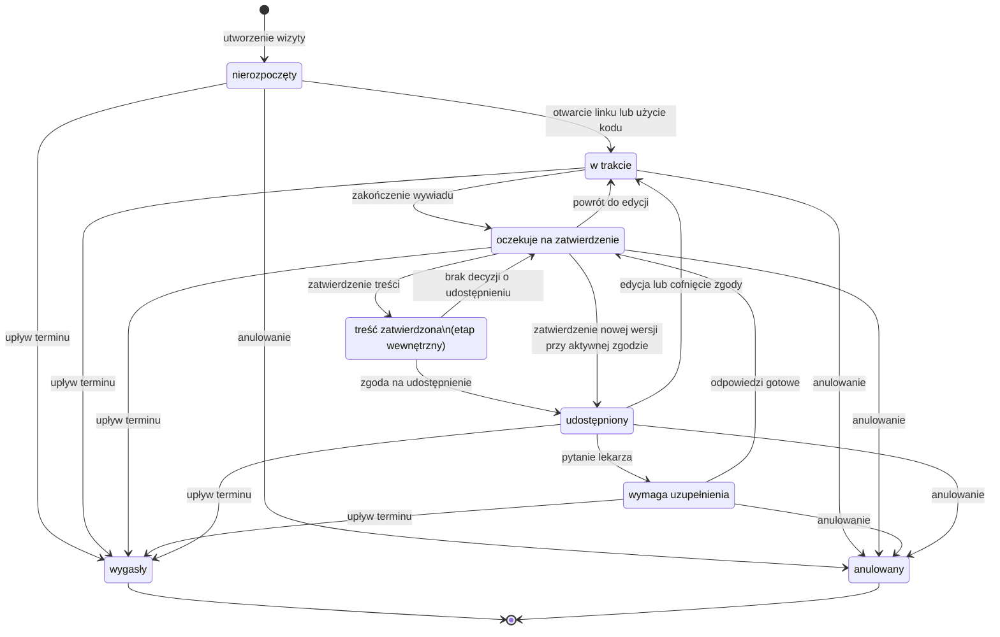
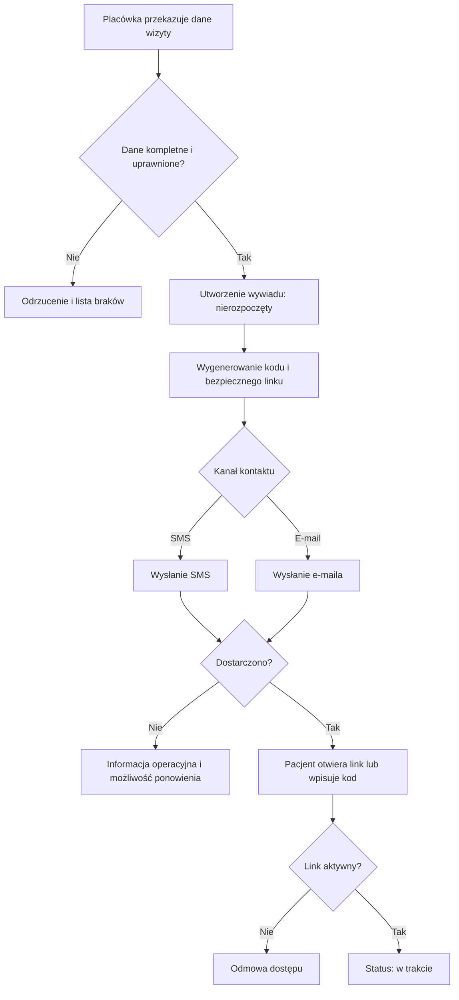
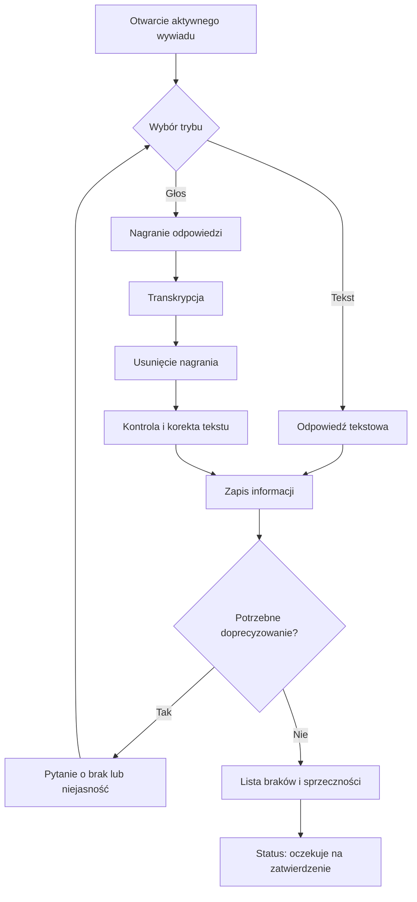
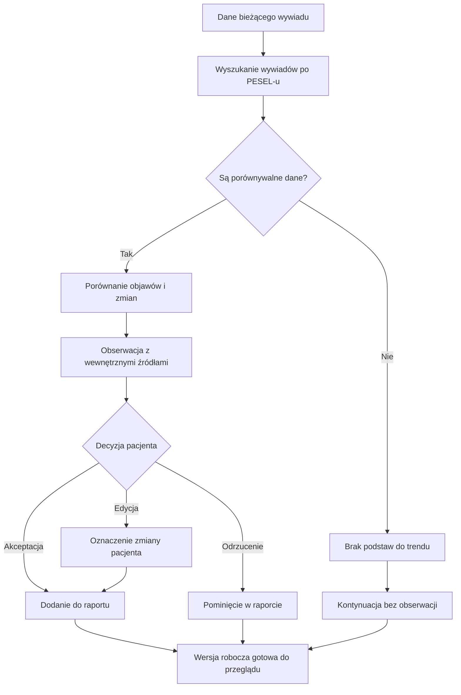
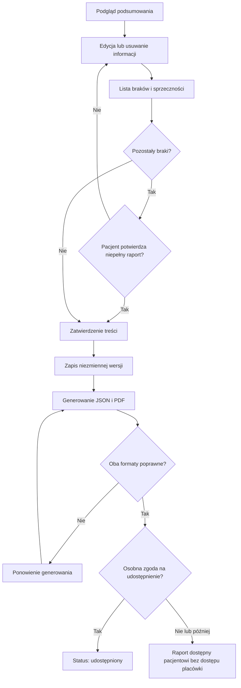
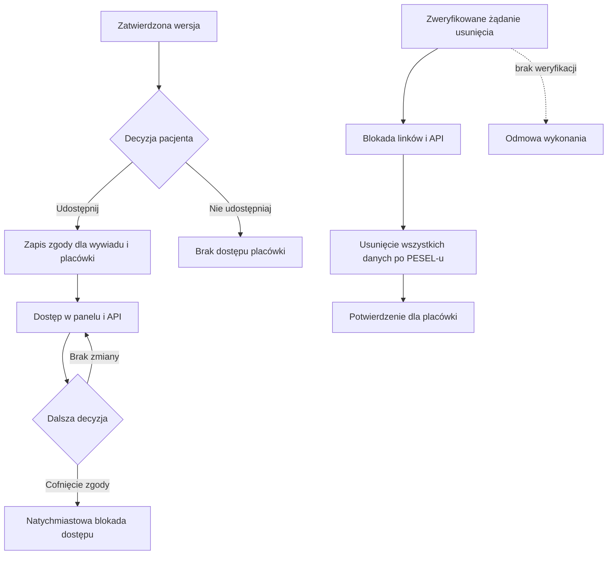
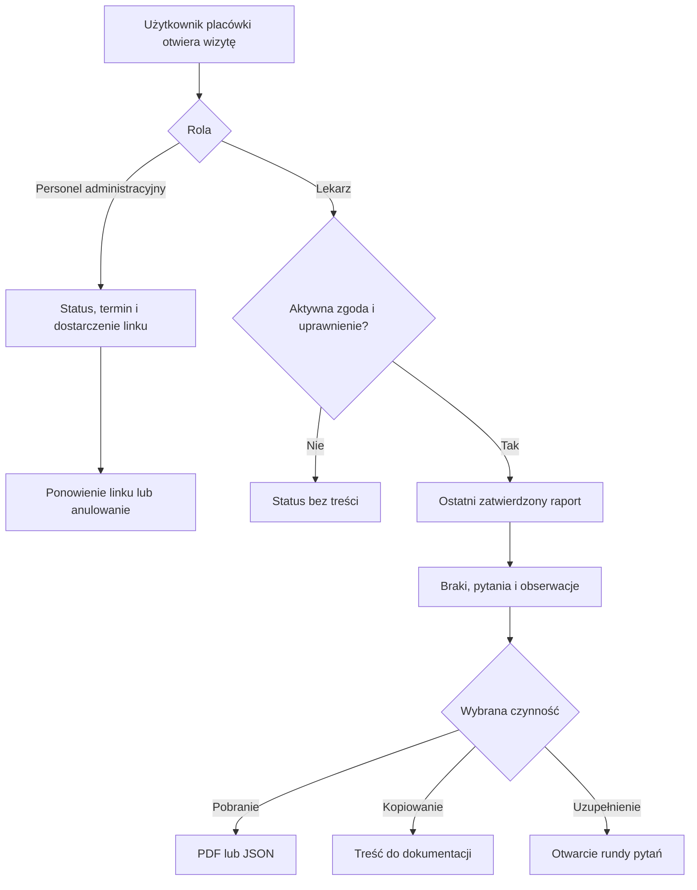
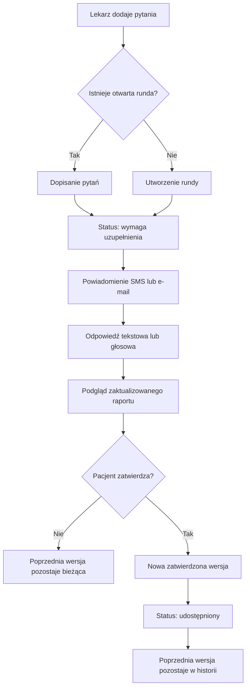
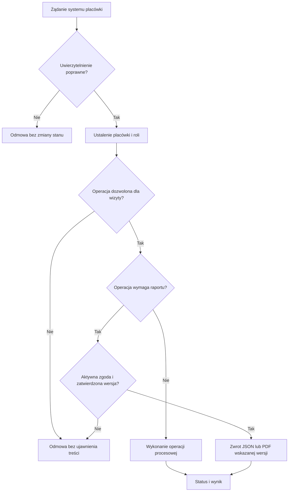

# DocPrep - dokumentacja procesów MVP

**Wersja:** 1.0  
**Status:** specyfikacja docelowa (TO-BE)  
**Odbiorca:** zespół projektowy i implementacyjny  
**Język diagramów:** Mermaid zgodny z GitHub Markdown

## 1. Cel i zakres dokumentu

Dokument opisuje procesy, które ma wspierać DocPrep w wersji MVP. DocPrep pomaga pacjentowi przygotować informacje przed wizytą, przekazać zatwierdzony raport placówce oraz odpowiedzieć na pytania uzupełniające lekarza. Dokument jest specyfikacją zachowania rozwiązania, a nie opisem aktualnego procesu bez DocPrep.

MVP obejmuje wywiad tekstowy i głosowy, uporządkowanie danych, obserwacje AI oparte na wcześniejszych wywiadach, zatwierdzanie i wersjonowanie raportu, udostępnianie danych, panel placówki oraz integrację przez API.

MVP nie obejmuje:

- diagnozowania ani sugerowania diagnozy;
- zalecania leczenia lub zmiany leków;
- oceny pilności objawów;
- wykrywania sygnałów alarmowych i wyświetlania komunikatów dla nagłych przypadków;
- analizy wyników badań;
- obsługi przebiegu wizyty po jej rozpoczęciu;
- samodzielnego przeglądania pełnej historii wywiadów przez pacjenta;
- produkcyjnej integracji z konkretnym systemem medycznym.

## 2. Aktorzy

| Aktor | Odpowiedzialność w DocPrep |
|---|---|
| Pacjent | Otwiera bezpieczny link lub wpisuje kod wizyty, przechodzi wywiad, poprawia dane, zatwierdza treść, decyduje o udostępnieniu i odpowiada na pytania lekarza. Nie posiada konta DocPrep. |
| Personel administracyjny | Tworzy lub monitoruje przygotowanie wizyty, wysyła ponownie link, anuluje proces i uruchamia zweryfikowane żądanie usunięcia. Widzi statusy, ale nie treść kliniczną. |
| Lekarz | Przegląda udostępniony raport, braki i dostępne źródła, zadaje pytania uzupełniające oraz wykorzystuje zatwierdzone dane podczas wizyty. |
| System placówki | Wywołuje uwierzytelnione operacje API dotyczące wizyt, linków, statusów, pytań i raportów. Działa wyłącznie w kontekście własnej placówki. |
| DocPrep | Zarządza procesem, uprawnieniami, wersjami, raportami, powiadomieniami i śladem operacji. |
| Moduł AI | Prowadzi wywiad, porządkuje dane i proponuje obserwacje. Nie diagnozuje, nie ocenia pilności i nie dopisuje faktów. |

## 3. Słownik

| Pojęcie | Definicja |
|---|---|
| Wizyta | Rekord przekazany przez placówkę, zawierający co najmniej identyfikator wizyty, identyfikator placówki, PESEL pacjenta, termin oraz kanał kontaktu. |
| Wywiad | Zbiór informacji przekazanych przez pacjenta dla jednej wizyty. |
| Wersja robocza | Bieżąca, edytowalna treść wywiadu niewidoczna dla placówki do czasu zatwierdzenia. |
| Zatwierdzona wersja | Niezmienny zapis treści zaakceptowanej przez pacjenta. Kolejna edycja tworzy nowy zapis w historii zmian. |
| Raport | Jednostronicowy PDF oraz odpowiadająca mu reprezentacja JSON wygenerowane z tej samej zatwierdzonej wersji. |
| Obserwacja AI | Propozycja opisująca nowy, powtarzający się lub zmieniający objaw na podstawie wywiadów powiązanych PESEL-em. |
| Źródło obserwacji | Identyfikator i data wcześniejszego wywiadu oraz fragment danych użyty do wygenerowania obserwacji. Źródła są przechowywane wewnętrznie. |
| Runda uzupełniająca | Otwarty zestaw pytań lekarza dla bieżącej wizyty. Nowe pytania są dopisywane do otwartej rundy. |
| Udostępnienie | Nadanie wskazanej placówce dostępu do zatwierdzonego wywiadu po osobnej zgodzie pacjenta. |
| Cofnięcie zgody | Zablokowanie dalszego dostępu w panelu i API bez możliwości wycofania kopii pobranych wcześniej przez placówkę. |
| Wygaśnięcie | Zakończenie możliwości dalszej pracy pacjenta po upływie okresu obsługi wizyty. Dostęp placówki do wcześniej udostępnionego raportu pozostaje aktywny. |
| Anulowanie | Zakończenie procesu przez placówkę wraz z unieważnieniem linku i zablokowaniem dostępu placówki w DocPrep oraz API. |

## 4. Diagram kontekstowy

## 5. Wspólne reguły biznesowe

| ID | Reguła |
|---|---|
| BR-01 | Pacjent nie tworzy konta. Rozpoczęcie wywiadu wymaga ważnego linku lub kodu wizyty wygenerowanego na podstawie danych placówki. |
| BR-02 | PESEL przekazuje placówka. Służy on wyłącznie do łączenia wywiadów i nie może być użyty jako samodzielny mechanizm uwierzytelnienia lub dostępu. |
| BR-03 | Link jest wysyłany SMS-em albo e-mailem zgodnie z kanałem wskazanym przy wizycie. Wygenerowanie nowego linku unieważnia poprzedni. |
| BR-04 | Link działa do końca okresu obsługi wizyty, chyba że wcześniej zostanie zastąpiony, anulowany albo dane zostaną usunięte. |
| BR-05 | Personel administracyjny widzi statusy i informacje operacyjne, ale nie widzi odpowiedzi, raportu ani pytań pacjenta. |
| BR-06 | Nagranie głosowe jest przetwarzane wyłącznie w celu transkrypcji i usuwane po jej utworzeniu. DocPrep przechowuje tylko tekst sprawdzany przez pacjenta. |
| BR-07 | AI może dopytywać i porządkować wyłącznie informacje wynikające z wypowiedzi pacjenta. Nie może dopisywać brakujących faktów. |
| BR-08 | Brak wzmianki o wcześniejszym objawie nie oznacza jego ustąpienia. Przy niewystarczających danych AI wskazuje brak podstaw do określenia trendu. |
| BR-09 | AI może porównywać wszystkie wywiady powiązane tym samym PESEL-em, niezależnie od placówki. |
| BR-10 | Pacjent nie przegląda wcześniejszych wywiadów ani źródeł obserwacji. Może zaakceptować, odrzucić lub edytować samą obserwację. Edycja jest oznaczana jako zmiana pacjenta. |
| BR-11 | Lekarz widzi wcześniejszy wpis źródłowy tylko wtedy, gdy pacjent osobno udostępnił ten wywiad tej samej placówce. |
| BR-12 | Pacjent może zatwierdzić raport zawierający braki lub sprzeczności po ich wyraźnym pokazaniu i świadomym potwierdzeniu. |
| BR-13 | Zatwierdzenie treści i zgoda na udostępnienie są osobnymi czynnościami. Jedna zgoda dotyczy jednego wywiadu i jednej placówki. |
| BR-14 | Kolejna wersja tego samego wywiadu wymaga ponownego zatwierdzenia treści, ale pozostaje objęta aktywną zgodą na ten wywiad. |
| BR-15 | Podczas edycji lekarz nadal widzi ostatnią zatwierdzoną i udostępnioną wersję. Wersja robocza pozostaje niewidoczna. |
| BR-16 | Cofnięcie zgody blokuje dostęp w DocPrep oraz API. Nie usuwa plików ani danych pobranych wcześniej przez placówkę. |
| BR-17 | Po wygaśnięciu procesu placówka zachowuje dostęp do wcześniej udostępnionego raportu. Anulowanie wizyty blokuje ten dostęp. |
| BR-18 | Zweryfikowane przez placówkę żądanie usunięcia obejmuje wszystkie dane DocPrep powiązane z PESEL-em, także dane utworzone dla innych placówek. |
| BR-19 | Usunięcie nie obejmuje kopii zapisanych wcześniej poza DocPrep. Placówka odpowiada za weryfikację tożsamości osoby składającej żądanie. |
| BR-20 | Zatwierdzone wywiady i historia zmian są przechowywane do czasu skutecznego żądania usunięcia. |
| BR-21 | DocPrep nie diagnozuje, nie zaleca leczenia, nie ocenia pilności i nie wyświetla komunikatów dotyczących nagłych przypadków. |

## 6. Dane i wersjonowanie

### 6.1 Dane wizyty

- identyfikator placówki;
- identyfikator wizyty;
- PESEL pacjenta;
- termin wizyty i termin wygaśnięcia procesu;
- numer telefonu lub adres e-mail;
- identyfikator przypisanego lekarza, jeżeli jest znany;
- kanał dostarczenia linku.

### 6.2 Dane wywiadu

- powód konsultacji;
- objawy, ich początek, częstotliwość, nasilenie i wpływ na codzienne funkcjonowanie;
- chronologia zmian;
- leki i dawki;
- alergie;
- choroby przewlekłe;
- pytania pacjenta do lekarza;
- braki i sprzeczności;
- zatwierdzone obserwacje AI;
- odpowiedzi na pytania uzupełniające.

### 6.3 Zasady wersjonowania

1. Pacjent edytuje bieżącą wersję raportu w ramach tego samego wywiadu.
2. Każde zatwierdzenie tworzy niezmienny zapis wersji oraz odpowiadające mu JSON i PDF.
3. Rozpoczęcie kolejnej edycji nie zmienia ostatniej zatwierdzonej wersji widocznej dla lekarza.
4. Nowa zatwierdzona wersja staje się wersją bieżącą, a poprzednia pozostaje w historii.
5. Każda wersja przechowuje autora zmiany, czas zatwierdzenia i pochodzenie informacji: pacjent, lekarz albo AI.

## 7. Macierz uprawnień

| Czynność | Pacjent | Personel administracyjny | Lekarz | System placówki |
|---|---:|---:|---:|---:|
| Otworzenie wywiadu | Tak, ważnym linkiem lub kodem | Nie | Nie | Nie |
| Utworzenie wizyty i wywiadu | Nie | Tak | Nie | Tak |
| Ponowne wysłanie linku | Nie | Tak | Nie | Tak |
| Podgląd statusu | Status własnego procesu | Tak | Tak | Tak |
| Odczyt treści klinicznej | Bieżący wywiad | Nie | Po udostępnieniu | Po udostępnieniu i autoryzacji |
| Edycja odpowiedzi | Tak | Nie | Nie | Nie |
| Zatwierdzenie treści | Tak | Nie | Nie | Nie |
| Udzielenie lub cofnięcie zgody | Tak | Nie | Nie | Operacja techniczna tylko na podstawie decyzji pacjenta |
| Odczyt wcześniejszego źródła | Nie | Nie | Tylko po osobnym udostępnieniu | Tylko po osobnym udostępnieniu |
| Wysłanie pytań uzupełniających | Nie | Nie | Tak | Tak, w imieniu uprawnionego lekarza |
| Pobranie JSON lub PDF | Tak, dla własnej wersji | Nie | Po udostępnieniu | Po udostępnieniu i autoryzacji |
| Anulowanie wizyty | Nie | Tak | Nie | Tak |
| Uruchomienie usunięcia po PESEL-u | Nie bezpośrednio | Tak, po weryfikacji żądania | Nie | Tak, w kontekście uprawnionego procesu placówki |

## 8. Cykl życia wywiadu

Publiczne statusy procesu:

| Status | Znaczenie |
|---|---|
| `nierozpoczęty` | Wizyta istnieje, lecz pacjent nie otworzył ważnego linku ani kodu. |
| `w trakcie` | Pacjent rozpoczął wywiad albo edytuje treść po wcześniejszym zatwierdzeniu. |
| `oczekuje na zatwierdzenie` | Treść jest gotowa do przeglądu i zatwierdzenia przez pacjenta albo oczekuje na decyzję o udostępnieniu. |
| `udostępniony` | Placówka ma dostęp do ostatniej zatwierdzonej wersji na podstawie aktywnej zgody. |
| `wymaga uzupełnienia` | Istnieje otwarta runda pytań lekarza. Dodatkowe pytania są do niej dopisywane. |
| `wygasły` | Okres pracy pacjenta zakończył się; wcześniejszy dostęp placówki pozostaje aktywny. |
| `anulowany` | Placówka anulowała proces; link i dostęp placówki zostały zablokowane. |

Zatwierdzenie treści jest krótkim etapem wewnętrznym, a nie dodatkowym statusem panelu. Pozwala zachować rozdzielenie zatwierdzenia od zgody bez rozszerzania publicznej listy statusów.

Usunięcie danych jest operacją cyklu życia danych, a nie statusem wizyty. Po skutecznym usunięciu rekord procesu przestaje być dostępny.

## 9. Proces P-01: utworzenie wizyty i dostarczenie linku lub kodu

### Cel

Utworzenie wywiadu przypisanego do właściwej placówki, wizyty i PESEL-u oraz dostarczenie pacjentowi bezpiecznego sposobu rozpoczęcia procesu.

### Aktorzy i warunki

- **Aktor główny:** personel administracyjny albo system placówki.
- **Aktor wspierający:** DocPrep, dostawca SMS/e-mail.
- **Wyzwalacz:** zaplanowanie wizyty wymagającej przygotowania.
- **Warunki wstępne:** placówka jest uwierzytelniona; istnieje identyfikator wizyty, PESEL, termin oraz co najmniej jeden kanał kontaktu.

### Przebieg podstawowy

1. Placówka przekazuje dane wizyty, PESEL, kanał kontaktu i opcjonalnie lekarza.
2. DocPrep sprawdza kompletność i powiązanie danych z kontekstem placówki.
3. DocPrep tworzy wywiad ze statusem `nierozpoczęty`.
4. System generuje kod i bezpieczny link ważny do końca obsługi wizyty.
5. Link jest wysyłany SMS-em albo e-mailem.
6. Panel i API zwracają wynik dostarczenia bez ujawniania treści klinicznej.
7. Pacjent otwiera link lub wpisuje kod, a DocPrep zmienia status na `w trakcie`.

### Wyjątki

- Brak wymaganych danych: operacja nie tworzy wywiadu i zwraca listę braków.
- Błąd dostarczenia: wywiad pozostaje `nierozpoczęty`, a personel widzi informację operacyjną i może ponowić wysyłkę.
- Ponowne wysłanie: nowy link unieważnia poprzedni.
- Link nieważny, zastąpiony, wygasły lub anulowany: dostęp zostaje odrzucony bez ujawniania danych.

### Rezultat

Istnieje wywiad powiązany z wizytą i PESEL-em, a pacjent otrzymał aktywny link lub kod.

### Kryteria akceptacji

- **AC-01.1:** poprawne dane tworzą dokładnie jeden wywiad ze statusem `nierozpoczęty`.
- **AC-01.2:** otwarcie aktywnego linku zmienia status na `w trakcie`.
- **AC-01.3:** ponowne wygenerowanie linku unieważnia poprzedni.
- **AC-01.4:** błąd SMS/e-mail jest widoczny operacyjnie, ale nie ujawnia treści wywiadu.
- **AC-01.5:** PESEL nie pozwala samodzielnie otworzyć wywiadu.

## 10. Proces P-02: wywiad tekstowy lub głosowy

### Cel

Zebranie od pacjenta uporządkowanych informacji potrzebnych do przygotowania wizyty bez dopisywania faktów przez system.

### Aktorzy i warunki

- **Aktor główny:** pacjent.
- **Aktor wspierający:** DocPrep i moduł AI.
- **Wyzwalacz:** otwarcie aktywnego wywiadu.
- **Warunki wstępne:** status `w trakcie`, ważny link lub kod.

### Przebieg podstawowy

1. Pacjent wybiera tryb tekstowy albo głosowy.
2. DocPrep pyta o powód konsultacji, objawy, początek, częstotliwość, nasilenie i wpływ na funkcjonowanie.
3. System zbiera chronologię, leki i dawki, alergie, choroby przewlekłe oraz pytania do lekarza.
4. AI zadaje pytania doprecyzowujące wyłącznie na podstawie dotychczasowych odpowiedzi.
5. W trybie głosowym odpowiedź jest transkrybowana, a nagranie usuwane po utworzeniu tekstu.
6. Pacjent sprawdza i może poprawić transkrypcję albo przejść do pisania.
7. DocPrep oznacza puste, nieznane lub sprzeczne informacje bez samodzielnego ich uzupełniania.
8. Po zakończeniu zbierania danych status zmienia się na `oczekuje na zatwierdzenie`.

### Wyjątki

- Nieudana transkrypcja: system zachowuje wcześniej zatwierdzony tekst i proponuje ponowienie lub przejście do trybu tekstowego.
- Przerwanie sesji: zapisane odpowiedzi pozostają wersją roboczą, a status pozostaje `w trakcie`.
- Niejednoznaczna odpowiedź: AI prosi o doprecyzowanie albo oznacza brak.
- Niedostępność AI: pacjent może kontynuować przy użyciu formularza bez automatycznych pytań.

### Rezultat

Powstaje edytowalna, uporządkowana wersja robocza wywiadu z listą braków i sprzeczności.

### Kryteria akceptacji

- **AC-02.1:** pacjent może przełączać się między tekstem a głosem bez utraty zatwierdzonego tekstu.
- **AC-02.2:** nagranie nie pozostaje zapisane po transkrypcji.
- **AC-02.3:** każde pole raportu można poprawić albo usunąć.
- **AC-02.4:** system rozróżnia wartość podaną, brak, wartość nieznaną i sprzeczność.
- **AC-02.5:** AI nie dopisuje informacji, których pacjent nie przekazał.

## 11. Proces P-03: porównanie z historią i obserwacje AI

### Cel

Wykrycie możliwych zmian i powtarzalnych wzorców między bieżącym a wcześniejszymi wywiadami, bez przedstawiania ich jako diagnozy lub pewnego wniosku medycznego.

### Aktorzy i warunki

- **Aktor główny:** DocPrep i moduł AI.
- **Aktor decyzyjny:** pacjent.
- **Wyzwalacz:** dostępność wystarczających danych bieżącego wywiadu.
- **Warunki wstępne:** PESEL został przekazany przez placówkę; bieżący wywiad zawiera dane możliwe do porównania.

### Przebieg podstawowy

1. DocPrep wyszukuje wszystkie wcześniejsze wywiady powiązane PESEL-em.
2. Moduł AI porównuje objawy, daty, częstotliwość, nasilenie i wpływ na funkcjonowanie.
3. System klasyfikuje propozycję jako: nowy objaw, objaw ponownie zgłoszony, zmiana albo powtarzalny wzorzec.
4. Każda obserwacja otrzymuje wewnętrzne odwołania do wywiadów, dat i fragmentów źródłowych.
5. Pacjent widzi treść obserwacji, lecz nie widzi źródeł ani pełnej historii.
6. Pacjent akceptuje, odrzuca albo edytuje każdą obserwację.
7. Edytowana obserwacja otrzymuje oznaczenie zmiany przez pacjenta.
8. Tylko zaakceptowane lub edytowane i zatwierdzone obserwacje trafiają do raportu.

### Wyjątki

- Brak wcześniejszych wywiadów: DocPrep informuje, że porównanie jest niedostępne.
- Niewystarczające dane: system oznacza brak podstaw do określenia trendu.
- Brak wzmianki o objawie: system nie oznacza go jako ustępującego.
- Awaria modułu AI: wywiad może być zatwierdzony bez obserwacji.

### Rezultat

Do wersji roboczej trafia zestaw decyzji pacjenta dotyczących obserwacji, wraz z wewnętrznym śladem źródłowym.

### Kryteria akceptacji

- **AC-03.1:** porównanie obejmuje wszystkie wywiady po tym samym PESEL-u.
- **AC-03.2:** każda wygenerowana obserwacja ma wewnętrzne źródła albo status braku podstaw.
- **AC-03.3:** pacjent może niezależnie zaakceptować, odrzucić lub edytować każdą obserwację.
- **AC-03.4:** pacjent nie może otworzyć wcześniejszego wywiadu ani źródła obserwacji.
- **AC-03.5:** brak wzmianki nie jest interpretowany jako ustąpienie objawu.

## 12. Proces P-04: weryfikacja, zatwierdzenie i raport

### Cel

Zapewnienie pacjentowi pełnej kontroli nad treścią oraz utworzenie spójnego PDF i JSON wyłącznie z zatwierdzonych informacji.

### Aktorzy i warunki

- **Aktor główny:** pacjent.
- **Aktor wspierający:** DocPrep.
- **Wyzwalacz:** zakończenie wywiadu i przygotowanie podsumowania.
- **Warunki wstępne:** status `oczekuje na zatwierdzenie`.

### Przebieg podstawowy

1. DocPrep pokazuje podsumowanie: powód konsultacji, chronologię, objawy, leki, alergie, choroby przewlekłe, pytania i obserwacje.
2. Pacjent może poprawić lub usunąć każdą informację.
3. System pokazuje listę braków i sprzeczności.
4. Jeżeli braki pozostają, pacjent potwierdza, że chce zatwierdzić niepełny raport.
5. Pacjent zatwierdza treść.
6. DocPrep zapisuje niezmienną wersję i generuje jednostronicowy PDF oraz zgodny JSON.
7. DocPrep osobno pyta o zgodę na udostępnienie placówce.
8. Po zgodzie status zmienia się na `udostępniony`. Bez decyzji o udostępnieniu status panelu pozostaje `oczekuje na zatwierdzenie`, choć zatwierdzona wersja jest dostępna pacjentowi.

### Wyjątki

- Powrót do edycji: status zmienia się na `w trakcie`.
- Błąd generowania PDF: zatwierdzona wersja pozostaje zapisana; generowanie można ponowić bez ponownego zatwierdzania.
- Niespójność JSON i PDF: raport nie zostaje udostępniony do czasu ponownego poprawnego wygenerowania obu formatów.

### Rezultat

Powstaje zatwierdzona, wersjonowana treść oraz odpowiadający jej JSON i jednostronicowy PDF.

### Kryteria akceptacji

- **AC-04.1:** raport zawiera wyłącznie zatwierdzone dane pacjenta i zaakceptowane obserwacje.
- **AC-04.2:** braki nie blokują zatwierdzenia po świadomym potwierdzeniu pacjenta.
- **AC-04.3:** PDF i JSON mają ten sam identyfikator wersji i zgodną treść.
- **AC-04.4:** błąd PDF nie niszczy zatwierdzonej wersji.
- **AC-04.5:** zgoda na udostępnienie nie jest domyślnie zaznaczona ani połączona z zatwierdzeniem treści.

## 13. Proces P-05: udostępnienie, cofnięcie zgody i usunięcie

### Cel

Kontrolowanie dostępu placówki do zatwierdzonych danych oraz obsługa cofnięcia zgody i zweryfikowanego żądania usunięcia.

### Aktorzy i warunki

- **Aktor główny dla zgody:** pacjent.
- **Aktor główny dla usunięcia:** personel administracyjny po weryfikacji żądania pacjenta.
- **Aktor wspierający:** DocPrep i system placówki.
- **Warunki wstępne udostępnienia:** istnieje zatwierdzona wersja raportu.

### Przebieg udostępnienia

1. DocPrep pokazuje pacjentowi placówkę i zakres udostępnianego wywiadu.
2. Pacjent udziela osobnej zgody dla tego wywiadu.
3. DocPrep zapisuje zgodę, czas i odbiorcę.
4. Placówka uzyskuje dostęp do bieżącej zatwierdzonej wersji w panelu i API.
5. Kolejne zatwierdzone wersje są dostępne w ramach tej samej aktywnej zgody.

### Cofnięcie zgody

1. Pacjent wybiera cofnięcie zgody z aktywnego linku albo składa zweryfikowane żądanie przez placówkę.
2. DocPrep natychmiast blokuje dalszy odczyt w panelu i API.
3. Status wraca do `w trakcie`, a zatwierdzone wersje pozostają w DocPrep.
4. System informuje, że wcześniej pobranych kopii nie można wycofać.

### Usunięcie danych

1. Placówka weryfikuje tożsamość i zakres żądania poza DocPrep.
2. Uprawniony personel uruchamia usunięcie dla PESEL-u.
3. DocPrep blokuje aktywne linki i dostęp API.
4. DocPrep usuwa wszystkie wizyty, wywiady, wersje, obserwacje, zgody i dane kontaktowe powiązane z PESEL-em.
5. Placówka otrzymuje potwierdzenie wykonania i przypomnienie, że kopie zewnętrzne pozostają poza DocPrep.

### Wyjątki

- Brak zatwierdzonej wersji: udostępnienie jest niemożliwe.
- Cofnięcie zgody po wygaśnięciu linku: wymaga zweryfikowanego zgłoszenia przez placówkę.
- Niezweryfikowane żądanie usunięcia: operacja nie jest wykonywana.
- Częściowy błąd usunięcia: dostęp zostaje zablokowany, a operacja trafia do ponowienia i kontroli.

### Kryteria akceptacji

- **AC-05.1:** bez zapisanej zgody placówka nie może odczytać raportu.
- **AC-05.2:** cofnięcie zgody blokuje panel i API bez usuwania pobranych wcześniej kopii.
- **AC-05.3:** zgoda wskazuje konkretny wywiad i placówkę.
- **AC-05.4:** usunięcie obejmuje wszystkie dane DocPrep powiązane PESEL-em, niezależnie od placówki.
- **AC-05.5:** niezweryfikowane żądanie nie zmienia danych ani dostępu.

## 14. Proces P-06: monitoring przygotowania i przegląd lekarski

### Cel

Zapewnienie placówce widoczności operacyjnej oraz lekarzowi szybkiego, kontrolowanego dostępu do udostępnionych informacji.

### Aktorzy i warunki

- **Aktorzy główni:** personel administracyjny i lekarz.
- **Aktor wspierający:** DocPrep.
- **Wyzwalacz:** otwarcie panelu przygotowania wizyt.
- **Warunki wstępne:** użytkownik placówki jest uwierzytelniony i działa w kontekście własnej organizacji.

### Przebieg personelu administracyjnego

1. Personel otwiera listę nadchodzących wizyt.
2. DocPrep pokazuje status, wynik dostarczenia linku, termin oraz informację o otwartej rundzie pytań.
3. Personel może ponowić wysyłkę, skopiować kod albo anulować proces.
4. Panel nie pokazuje treści klinicznej ani PDF.

### Przebieg lekarza

1. Lekarz otwiera wizytę z aktywnie udostępnionym raportem.
2. DocPrep pokazuje powód konsultacji, chronologię, objawy, leki, alergie, choroby przewlekłe, pytania, braki i obserwacje.
3. System jednoznacznie oznacza informacje pacjenta, obserwacje AI i zmiany wprowadzone przez pacjenta.
4. Lekarz widzi ostatnią zatwierdzoną wersję, nawet jeżeli pacjent edytuje nową wersję roboczą.
5. Wcześniejszy wpis źródłowy jest dostępny tylko po osobnym udostępnieniu tej placówce.
6. Lekarz może pobrać PDF, skopiować treść albo przejść do pytań uzupełniających.

### Wyjątki

- Brak zgody albo cofnięta zgoda: lekarz widzi status bez treści.
- Anulowana wizyta: dostęp zostaje zablokowany.
- Wygasła wizyta: ostatni udostępniony raport pozostaje dostępny.
- Brak przypisania lekarza: raport nie jest pokazywany do czasu nadania właściwego uprawnienia.

### Kryteria akceptacji

- **AC-06.1:** personel administracyjny nie może odczytać treści klinicznej.
- **AC-06.2:** lekarz widzi wyłącznie raporty udostępnione jego placówce i przypisane do właściwej wizyty.
- **AC-06.3:** wersja robocza pacjenta nie jest widoczna lekarzowi.
- **AC-06.4:** informacje pacjenta i obserwacje AI są wizualnie rozróżnione.
- **AC-06.5:** źródło historyczne jest dostępne tylko po osobnym udostępnieniu.

## 15. Proces P-07: pytania uzupełniające i ponowne zatwierdzenie

### Cel

Umożliwienie lekarzowi wyjaśnienia braków przed wizytą bez edytowania treści w imieniu pacjenta.

### Aktorzy i warunki

- **Aktorzy główni:** lekarz i pacjent.
- **Aktor wspierający:** DocPrep, SMS/e-mail.
- **Wyzwalacz:** lekarz wybiera prośbę o uzupełnienie.
- **Warunki wstępne:** istnieje udostępniony raport i aktywne uprawnienie lekarza.

### Przebieg podstawowy

1. Lekarz wpisuje pytanie lub zestaw pytań.
2. Jeśli istnieje otwarta runda, DocPrep dopisuje nowe pytania do tej rundy; w przeciwnym razie tworzy nową rundę.
3. Status zmienia się na `wymaga uzupełnienia`.
4. DocPrep wysyła pacjentowi powiadomienie wybranym dla wizyty kanałem.
5. Pacjent otwiera aktywny link i odpowiada tekstowo albo głosowo.
6. Pacjent może poprawić transkrypcję; nagranie jest usuwane po transkrypcji.
7. Po zakończeniu odpowiedzi status zmienia się na `oczekuje na zatwierdzenie`.
8. Pacjent przegląda cały zaktualizowany raport i zatwierdza nową wersję.
9. Przy aktywnej zgodzie nowa wersja staje się dostępna lekarzowi, a status wraca do `udostępniony`.
10. Poprzednia zatwierdzona wersja pozostaje w historii.

### Wyjątki

- Błąd dostarczenia: runda pozostaje otwarta, a placówka widzi problem operacyjny.
- Pacjent nie zakończył odpowiedzi: lekarz nadal widzi poprzednią wersję i status `wymaga uzupełnienia`.
- Pacjent odrzuca zmianę: poprzednia wersja pozostaje bieżącą wersją udostępnioną.
- Wygasły lub anulowany proces: nie można dodać kolejnych pytań.

### Kryteria akceptacji

- **AC-07.1:** nowe pytania są dopisywane do jednej otwartej rundy.
- **AC-07.2:** lekarz nie widzi odpowiedzi przed zatwierdzeniem przez pacjenta.
- **AC-07.3:** podczas rundy uzupełniającej poprzednia wersja pozostaje dostępna.
- **AC-07.4:** zatwierdzenie tworzy nową wersję bez nadpisania poprzedniej.
- **AC-07.5:** po zamknięciu rundy lekarz może rozpocząć kolejną przed wygaśnięciem procesu.

## 16. Proces P-08: API i wykorzystanie w dokumentacji medycznej

### Cel

Udostępnienie systemowi placówki tych samych dozwolonych działań i danych co panel, z zachowaniem kontekstu organizacji, zgód i wersji.

### Aktorzy i warunki

- **Aktor główny:** system placówki.
- **Aktorzy korzystający z wyniku:** personel administracyjny i lekarz.
- **Warunki wstępne:** klient API jest uwierzytelniony i powiązany z konkretną placówką.

### Operacje i efekty

| Operacja | Minimalne dane wejściowe | Rezultat i wpływ na stan |
|---|---|---|
| Utworzenie wywiadu | Wizyta, PESEL, termin, kanał kontaktu | Tworzy proces `nierozpoczęty`. |
| Wygenerowanie lub ponowienie linku | Identyfikator wizyty, kanał | Zwraca wynik wysyłki; nowy link unieważnia poprzedni. |
| Pobranie statusów | Zakres wizyt placówki | Zwraca statusy i informacje operacyjne bez treści klinicznej dla roli administracyjnej. |
| Anulowanie procesu | Identyfikator wizyty | Ustawia `anulowany`, unieważnia link i blokuje dostęp. |
| Przekazanie pytań | Wizyta, lekarz, treść pytań | Tworzy lub rozszerza otwartą rundę i ustawia `wymaga uzupełnienia`. |
| Pobranie wersji | Wizyta, uprawnienie lekarza | Zwraca listę zatwierdzonych wersji dostępnych w ramach aktywnej zgody. |
| Pobranie JSON | Wizyta i wersja | Zwraca zatwierdzone dane, obserwacje i braki po sprawdzeniu zgody. |
| Pobranie PDF | Wizyta i wersja | Zwraca PDF wygenerowany z tej samej wersji co JSON. |
| Rejestracja cofnięcia zgody | Wizyta, decyzja pacjenta | Blokuje dalszy dostęp w panelu i API. |
| Usunięcie po PESEL-u | Potwierdzone uprawnienie i zweryfikowane żądanie | Blokuje dostęp i usuwa wszystkie dane DocPrep powiązane PESEL-em. |

### Przebieg podstawowy

1. System placówki uwierzytelnia klienta.
2. DocPrep ustala kontekst placówki i dopuszczalną operację.
3. System przekazuje żądanie z identyfikatorem wizyty lub PESEL-em tylko tam, gdzie operacja tego wymaga.
4. DocPrep sprawdza rolę, przynależność wizyty, zgodę i dostępność wersji.
5. Operacja jest wykonywana, a wynik zawiera identyfikator procesu, status i jednoznaczny rezultat.
6. Przy pobraniu raportu placówka wykorzystuje JSON do integracji albo PDF/kopiowanie do dokumentacji medycznej.

### Wyjątki

- Brak uwierzytelnienia: brak dostępu i brak zmiany stanu.
- Próba dostępu do innej placówki: brak ujawnienia istnienia treści.
- Brak zgody lub jej cofnięcie: status może być zwrócony, lecz treść raportu nie.
- Nieistniejąca albo niezatwierdzona wersja: brak raportu.
- Błąd generowania formatu: zatwierdzona wersja pozostaje nienaruszona, a operację można ponowić.

### Kryteria akceptacji

- **AC-08.1:** każda operacja jest ograniczona do uwierzytelnionej placówki i roli.
- **AC-08.2:** API nie zwraca niezatwierdzonej wersji roboczej.
- **AC-08.3:** JSON i PDF wskazują ten sam identyfikator wersji.
- **AC-08.4:** cofnięcie zgody natychmiast blokuje kolejne pobrania.
- **AC-08.5:** błąd uwierzytelnienia lub autoryzacji nie zmienia stanu procesu.

## 17. Wspólna obsługa błędów i sytuacji granicznych

| Sytuacja | Zachowanie DocPrep |
|---|---|
| Link nieprawidłowy, zastąpiony lub wygasły | Odmowa dostępu bez ujawnienia danych; możliwość kontaktu z placówką poza DocPrep. |
| Niedostarczenie SMS/e-mail | Status wywiadu nie zmienia się; panel i API pokazują błąd operacyjny oraz możliwość ponowienia. |
| Błąd transkrypcji | Pacjent może ponowić nagranie albo pisać; błędny tekst nie jest automatycznie zatwierdzany. |
| Niedostępność AI | Wywiad formularzowy pozostaje dostępny; raport może powstać bez obserwacji AI. |
| Brak danych do trendu | System pokazuje brak podstaw zamiast tworzyć obserwację. |
| Sprzeczne daty lub wartości | Obie informacje są zachowane jako sprzeczność wymagająca wyjaśnienia. |
| Błąd generowania PDF | Zatwierdzona wersja pozostaje zapisana; system ponawia generowanie bez zmiany treści. |
| Błąd uwierzytelnienia API | Żądanie jest odrzucane i nie zmienia stanu. |
| Brak zgody | Placówka może widzieć dozwolony status operacyjny, ale nie treść. |
| Anulowanie podczas pracy | Link zostaje unieważniony, niezapisana sesja przestaje być dostępna, a dostęp placówki zostaje zablokowany. |
| Wygaśnięcie podczas otwartej rundy | Dalsza odpowiedź jest zablokowana; ostatnia udostępniona wersja pozostaje dostępna placówce. |
| Częściowy błąd usuwania | Dostęp jest blokowany, operacja trafia do kontroli i ponowienia, a system nie zgłasza sukcesu przed pełnym zakończeniem. |

## 18. Macierz śledzenia 14 funkcji MVP

| ID | Funkcja z karty projektu | Procesy | Kryteria akceptacji |
|---|---|---|---|
| F-01 | Wywiad tekstowy i głosowy wspierany przez AI | P-02, P-07 | AC-02.1-AC-02.5, AC-07.1-AC-07.5 |
| F-02 | Chronologia objawów | P-02, P-04 | AC-02.3-AC-02.5, AC-04.1 |
| F-03 | Leki, dawki, alergie i choroby przewlekłe | P-02, P-04 | AC-02.3-AC-02.5, AC-04.1 |
| F-04 | Pytania pacjenta do lekarza | P-02, P-04, P-06 | AC-02.3, AC-04.1, AC-06.2 |
| F-05 | Podgląd i zatwierdzenie podsumowania | P-04 | AC-04.1-AC-04.5 |
| F-06 | Jednostronicowy raport PDF | P-04, P-08 | AC-04.3-AC-04.4, AC-08.3 |
| F-07 | API integracyjne | P-01, P-07, P-08 | AC-01.1-AC-01.4, AC-07.1, AC-08.1-AC-08.5 |
| F-08 | Historia wywiadów wykorzystywana przez system | P-03, P-04 | AC-03.1-AC-03.5, AC-04.1 |
| F-09 | Zmiany i powtarzalne trendy | P-03 | AC-03.1-AC-03.5 |
| F-10 | Panel przygotowania do wizyt | P-01, P-06 | AC-01.1-AC-01.4, AC-06.1-AC-06.5 |
| F-11 | Szybki przegląd dla lekarza | P-06 | AC-06.2-AC-06.5 |
| F-12 | Braki i niejasności do wyjaśnienia | P-02, P-04, P-06 | AC-02.4, AC-04.2, AC-06.2 |
| F-13 | Prośba o uzupełnienie wywiadu | P-07 | AC-07.1-AC-07.5 |
| F-14 | Wsparcie dokumentacji wizyty | P-06, P-08 | AC-06.4, AC-08.2-AC-08.4 |

## 19. Przekrojowy scenariusz demo

### Dane demonstracyjne

Wszystkie wizyty dotyczą fikcyjnego pacjenta o tym samym demonstracyjnym PESEL-u.

| Wywiad | Dane pacjenta | Rola w demonstracji |
|---|---|---|
| W-01 | Ból głowy 3/10 około dwa razy w tygodniu, zwykle po krótkim śnie. | Punkt odniesienia. |
| W-02 | Ból głowy 6/10 prawie codziennie oraz nowo zgłoszone nudności. | Zmiana nasilenia i nowy objaw. |
| W-03 | Ponownie zgłoszony ból głowy 4/10 około raz w tygodniu, częściej po długiej pracy przy ekranie. | Powtarzalna dolegliwość i kolejna zmiana częstotliwości/nasilenia. |

### Przebieg demo

1. System placówki tworzy W-03 przez API, przekazując wizytę, PESEL i kanał kontaktu.
2. Panel pokazuje status `nierozpoczęty`, a pacjent otrzymuje link SMS-em lub e-mailem.
3. Pacjent otwiera link i rozpoczyna wywiad głosowy; status zmienia się na `w trakcie`.
4. Pacjent poprawia jeden fragment transkrypcji i przechodzi do odpowiedzi tekstowej.
5. DocPrep porównuje W-03 z W-01 i W-02.
6. AI proponuje obserwacje: ból głowy został zgłoszony ponownie, jego nasilenie jest niższe niż w W-02, a nudności nie zostały wspomniane i dlatego nie można uznać, że ustąpiły.
7. Pacjent widzi obserwacje bez źródeł, edytuje jedną z nich, odrzuca jedną i zatwierdza pozostałe.
8. DocPrep pokazuje brak informacji o dawce jednego leku. Pacjent zatwierdza raport mimo braku.
9. System generuje zgodny JSON i jednostronicowy PDF.
10. Pacjent osobno udziela zgody na udostępnienie W-03 placówce; status zmienia się na `udostępniony`.
11. Personel administracyjny widzi status, ale nie treść. Lekarz widzi raport, braki i zaakceptowane obserwacje.
12. Lekarz pyta: „Czy ból głowy nasila się podczas wysiłku?”. Status zmienia się na `wymaga uzupełnienia`.
13. Lekarz dodaje drugie pytanie przed odpowiedzią pacjenta; pytanie trafia do tej samej otwartej rundy.
14. Pacjent odpowiada, sprawdza cały raport i zatwierdza nową wersję.
15. Lekarz otrzymuje zaktualizowany raport, a poprzednia wersja nadal jest dostępna w historii.
16. API placówki pobiera JSON i PDF tej samej wersji.

### Oczekiwany wynik demo

- wszystkie przejścia statusów są widoczne w panelu i API;
- pacjent kontroluje treść i zgodę;
- personel administracyjny nie widzi danych klinicznych;
- lekarz nie widzi wersji roboczej;
- AI pokazuje zmianę i powtarzalność bez diagnozy;
- poprzednie wersje nie są nadpisywane;
- JSON i PDF są przypisane do właściwej wizyty i wersji.

## 20. Lista kontrolna odbioru dokumentacji i implementacji

- [ ] Wszystkie dziesięć diagramów Mermaid renderuje się w GitHub Markdown.
- [ ] Każda z 14 funkcji ma przypisany proces i kryteria akceptacji.
- [ ] Każdy publiczny status występuje w tabeli i diagramie stanów.
- [ ] Role personelu administracyjnego i lekarza mają odrębne uprawnienia.
- [ ] PESEL nie jest mechanizmem dostępu.
- [ ] Nie istnieje ścieżka rozpoczęcia wywiadu bez linku lub kodu wizyty.
- [ ] Nagrania głosowe nie są przechowywane po transkrypcji.
- [ ] Pacjent nie może przeglądać wcześniejszych wywiadów ani źródeł obserwacji.
- [ ] Wersja robocza nie jest widoczna placówce.
- [ ] Braki można zatwierdzić po świadomym potwierdzeniu.
- [ ] Zatwierdzenie i zgoda są osobnymi czynnościami.
- [ ] Cofnięcie zgody, wygaśnięcie i anulowanie mają różne skutki dostępu.
- [ ] Usunięcie po PESEL-u obejmuje wszystkie dane DocPrep, ale nie kopie zewnętrzne.
- [ ] Błędy SMS/e-mail, transkrypcji, AI, PDF i API mają opisane zachowanie.
- [ ] Dokument nie przypisuje DocPrep diagnozowania, leczenia ani oceny pilności.
