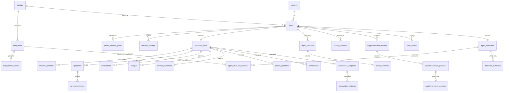
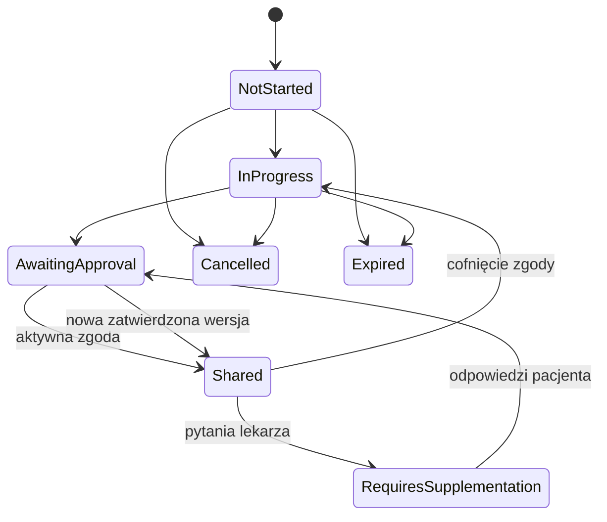

# DocPrep — przewodnik po backendzie

Dokument jest krótkim wprowadzeniem do aktualnego backendu: modelu danych, domeny i najważniejszej logiki biznesowej. Backend jest modularnym monolitem ASP.NET Core 8 z PostgreSQL, Redisem i integracją ElevenLabs.

## 1. Schemat bazy danych

Dane relacyjne znajdują się w PostgreSQL, w schemacie `docprep`. Redis przechowuje wyłącznie krótkotrwałe sesje pacjenta i nie jest źródłem danych biznesowych.

### Główne relacje



### Najważniejsze tabele

| Obszar | Tabele | Odpowiedzialność |
|---|---|---|
| Organizacja | `facilities`, `staff_users`, `staff_refresh_tokens` | Placówki, personel, role i rotowane sesje logowania. |
| Pacjent i wizyta | `patients`, `visits` | Zaszyfrowana tożsamość pacjenta i proces przygotowania konkretnej wizyty. |
| Dostęp pacjenta | `patient_access_grants`, `delivery_attempts` | Hashe linków/kodów oraz historia dostarczenia zaproszeń. |
| Wywiad formularzowy | `interview_drafts` i jego tabele podrzędne | Edytowalny draft: objawy, leki, alergie, odpowiedzi, pytania i braki. |
| Raport | `report_versions`, `report_evidence` | Niezmienne, zatwierdzone wersje JSON/PDF wraz ze źródłami obserwacji. |
| Udostępnianie | `sharing_consents` | Aktywna lub cofnięta zgoda na dostęp placówki do raportu. |
| Uzupełnienia | `supplementation_rounds`, `supplementation_questions`, `supplementation_answers` | Pytania lekarza i odpowiedzi pacjenta prowadzące do kolejnej wersji. |
| ElevenLabs | `agent_interviews`, `agent_interview_sessions`, `interview_invitations` | Biznesowy wywiad, kolejne rozmowy voice/text i bezpieczne zaproszenia. |
| Techniczne | `audit_events`, `external_webhook_events`, `deletion_requests` | Audyt, idempotencja webhooków i obsługa usunięcia danych. |

### Istotne ograniczenia danych

- `(FacilityId, ExternalVisitId)` jest unikalne — placówka nie utworzy dwukrotnie tej samej wizyty.
- `patients.CorrelationKey` jest unikalnym HMAC-em PESEL-u; PESEL jest przechowywany osobno w postaci zaszyfrowanej.
- Surowe tokeny pacjenta i zaproszeń ElevenLabs nie trafiają do bazy — zapisywany jest SHA-256.
- `ProviderConversationId` ElevenLabs jest unikalny i stanowi klucz korelacji webhooka z sesją.
- Snapshot raportu, transcript, analysis, metadata i structured data są przechowywane jako `jsonb`.
- Zaproszenia, refresh tokeny i wizyty mają kontrolę współbieżności, aby równoległe żądania nie zużyły tokenu dwukrotnie.

Model EF Core znajduje się w [`DocPrepDbContext`](../Backend/src/DocPrep.Infrastructure/Persistence/DocPrepDbContext.cs), a historia zmian w katalogu [`Migrations`](../Backend/src/DocPrep.Infrastructure/Persistence/Migrations/).

## 2. Model domenowy

Backend jest podzielony na cztery warstwy:

```text
DocPrep.Api
  → endpointy, authentication, authorization, rate limiting, OpenAPI
DocPrep.Application
  → przypadki użycia i orkiestracja procesów
DocPrep.Domain
  → encje, statusy, niezmienniki i przejścia stanów
DocPrep.Infrastructure
  → EF Core, PostgreSQL, Redis, ElevenLabs, PDF i adaptery zewnętrzne
```

### Główne agregaty

#### `VisitProcess`

Centralny proces biznesowy. Łączy placówkę, pacjenta, termin wizyty, przypisanego lekarza i aktualny status przygotowania.



#### `InterviewDraft`

Edytowalny stan formularzowego wywiadu. Każda zmiana zwiększa `Revision`. Draft może generować `Clarification`, gdy brakuje dawki leku, daty początku objawu albo dane są sprzeczne.

#### `ReportVersion`

Niezmienny snapshot zatwierdzony przez pacjenta. Każda kolejna akceptacja tworzy nowy rekord; poprzednia wersja nie jest nadpisywana. JSON i PDF pochodzą z tego samego snapshotu.

#### `SharingConsent`

Zatwierdzenie raportu i zgoda na jego udostępnienie są osobnymi decyzjami. Bez aktywnej zgody lekarz nie odczyta JSON ani PDF, nawet gdy wersja raportu istnieje.

#### `AgentInterview`

Biznesowy wywiad niezależny od dostawcy rozmowy. Jedna wizyta ma jeden taki wywiad, ale wywiad może mieć wiele `AgentInterviewSession`, np. nieudaną próbę voice, wznowienie i późniejszy chat.

```text
VisitProcess
  └─ AgentInterview
       ├─ InterviewInvitation (hashed token, expiry, limit sesji)
       └─ AgentInterviewSession
            └─ ProviderConversationId → rozmowa ElevenLabs
```

`AgentInterviewSession` przechowuje jedynie identyfikator rozmowy oraz wynik po webhooku. Krótkotrwały `conversationToken` i `signedUrl` nigdy nie są zapisywane.

## 3. Najważniejsza logika biznesowa

### Utworzenie wizyty

1. Placówka przesyła zewnętrzny identyfikator wizyty, PESEL, termin, kontakt i opcjonalnego lekarza.
2. PESEL jest normalizowany, walidowany, korelowany przez HMAC i szyfrowany.
3. Powstają `VisitProcess`, pusty `InterviewDraft` oraz `AgentInterview`.
4. Powstają dwa niezależne mechanizmy dostępu:
   - link/kod do klasycznego wywiadu DocPrep,
   - `InterviewInvitation` do rozmowy ElevenLabs.
5. Odpowiedź zwraca surowe tokeny tylko raz; baza przechowuje ich hashe.

### Wywiad formularzowy i raport

1. Pacjent wymienia link lub kod na opaque session token zapisany w Redisie.
2. Uzupełnia draft, poprawia obserwacje i kończy wywiad.
3. Zatwierdzenie tworzy immutable `ReportVersion` i PDF.
4. Osobna zgoda publikuje zatwierdzoną wersję placówce.
5. Administracja widzi tylko statusy; lekarz widzi raport wyłącznie przy aktywnej zgodzie i zgodnym `AssignedClinicianId`.

### Rozmowa ElevenLabs

1. Publiczny token zaproszenia jest wymieniany na godzinny JWT ograniczony do jednego `interview_id`.
2. Backend ponownie sprawdza wizytę, wywiad, wygaśnięcie, unieważnienie i limit sesji.
3. Dla `Voice` backend pobiera token WebRTC, a dla `Text` signed URL WebSocket.
4. API key ElevenLabs pozostaje wyłącznie na backendzie.
5. `conversation_id` trafia do `AgentInterviewSession` i służy do późniejszej korelacji.
6. Podpisany webhook zapisuje transcript, analysis, metadata, Data Collection i końcowe podsumowanie.
7. `external_webhook_events` zapewnia idempotencję ponownych dostarczeń webhooka.

### Pytania uzupełniające

Lekarz może otworzyć rundę pytań tylko dla udostępnionego raportu przypisanego do niego. Pacjent odpowiada, ponownie zatwierdza treść i tworzy kolejną wersję. Poprzednia wersja pozostaje dostępna podczas edycji.

### Usuwanie i cofnięcie zgody

- Cofnięcie zgody natychmiast blokuje dalszy odczyt, ale nie usuwa kopii pobranych wcześniej przez placówkę.
- Zweryfikowane żądanie usunięcia usuwa dane pacjenta kaskadowo i unieważnia aktywne sesje Redis.
- Operacje wrażliwe są rejestrowane w `audit_events` bez zapisywania tokenów i pełnych danych medycznych w logach aplikacji.

## 4. Uwierzytelnianie w skrócie

| Odbiorca | Mechanizm | Zakres |
|---|---|---|
| Pacjent | opaque Bearer w Redisie | Jedna wizyta. |
| Publiczny wywiad ElevenLabs | krótki JWT | Jeden `interview_id` i jedno `invitation_id`. |
| Personel panelu | JWT + rotowany refresh token | Jedna placówka i rola administracyjna lub lekarska. |
| System placówki | `X-Api-Key` | Integracja serwer–serwer; klucz nie może trafić do przeglądarki. |
| ElevenLabs webhook | HMAC `ElevenLabs-Signature` | Wyłącznie podpisany payload w dopuszczalnym oknie czasu. |

Punktem startowym do dalszego czytania są [`Program.cs`](../Backend/src/DocPrep.Api/Program.cs), [`Endpoints.cs`](../Backend/src/DocPrep.Api/Endpoints.cs), serwisy w [`DocPrep.Application`](../Backend/src/DocPrep.Application/) oraz encje w [`DocPrep.Domain`](../Backend/src/DocPrep.Domain/).
