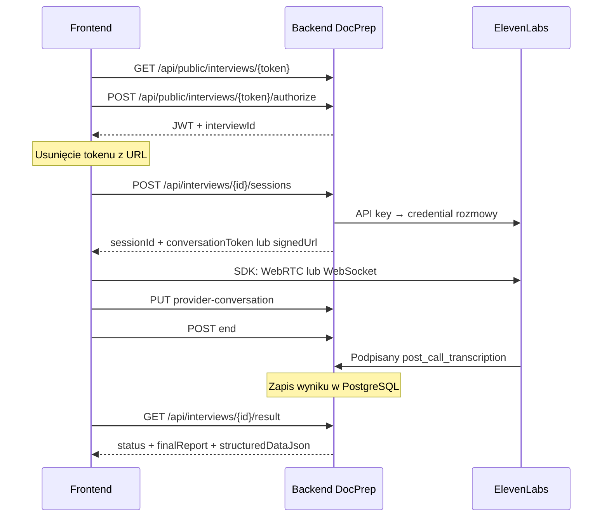

# ElevenLabs — konfiguracja i stan integracji DocPrep

Instrukcja dla aktualnego backendu **DocPrep** i frontendu **Przed wizytą**. Kod i dokumentację ElevenLabs sprawdzono 3 października 2026 r. [Dokument projektowy](elevenlabs-agent-integracja-front-back.md) opisuje założenia; poniżej znajduje się konfiguracja rzeczywiście zaimplementowanych endpointów.

**Wniosek:** obsługa rozmowy z linku, głosu, czatu, webhooka i pobierania podsumowania jest zaimplementowana. Integracja całej aplikacji pozostaje częściowa: konto pacjenta jest demo, a wynik ElevenLabs nie jest jeszcze przenoszony do zatwierdzanego raportu DocPrep dla lekarza. Testy używają atrapy ElevenLabs; działanie na rzeczywistym koncie wymaga konfiguracji i próby opisanej w sekcji 8.

## 1. Co oznacza „token” i gdzie go wpisać

| Wartość                             | Skąd pochodzi                                                            | Gdzie trafia                                                          |
| ----------------------------------- | ------------------------------------------------------------------------ | --------------------------------------------------------------------- |
| **ElevenLabs API key**              | Panel ElevenLabs → Developers → API Keys → utworzenie klucza             | `ELEVENLABS_API_KEY` w `Backend/.env` przy Docker Compose             |
| **Agent ID** (`agent_…`)            | Szczegóły utworzonego agenta w ElevenLabs                                | `ELEVENLABS_AGENT_ID` w `Backend/.env`                                |
| **Webhook secret**                  | Sekret wygenerowany przy konfiguracji webhooka w ElevenLabs              | `ELEVENLABS_WEBHOOK_SECRET` w `Backend/.env`                          |
| **Invitation token**                | Nasz backend: odpowiedź tworząca wizytę, pole `interviewInvitationToken` | Link frontendu `/i/{token}`; nie jest kluczem ElevenLabs              |
| **Anonymous JWT**                   | Nasz endpoint `/authorize`                                               | Frontend przechowuje w pamięci i wysyła w `Authorization: Bearer …`   |
| **Conversation token / signed URL** | ElevenLabs, pobierane automatycznie przez backend przed rozmową          | SDK frontendu; nie trzeba ich ręcznie pobierać ani wpisywać do `.env` |
| **Patient session token**           | Nasze `/api/v1/patient-access/link/exchange` lub `/code/exchange`        | Sesja dla jednej wizyty; osobna od JWT personelu i klucza ElevenLabs  |

Klucz API i sekret webhooka pozostają na serwerze. **Nie dodawaj ich do `Frontend/.env.local`, zmiennych `VITE_*` ani kodu React.** Pliki `Backend/.env` i `Frontend/.env.local` są ignorowane przez Git.

## 2. Pobierz klucz API z ElevenLabs

1. Zaloguj się do właściwego workspace ElevenLabs.
2. Otwórz **Developers → API Keys**. Dostępny jest też [bezpośredni adres ustawień kluczy](https://elevenlabs.io/app/settings/api-keys).
3. Utwórz nowy klucz, np. `docprep-backend`.
4. Nadaj dostęp do **Agents / Conversational AI**, potrzebny do wydawania credentiali rozmów. Klucz ograniczony wyłącznie do Text to Speech nie wystarczy. Nazwy przełączników w panelu mogą się różnić; docelowe operacje to oba endpointy wskazane w sekcji 7.
5. Skopiuj **pełny klucz API** od razu po utworzeniu. Panel pokazuje go w całości tylko wtedy; identyfikator klucza i ostatnie cztery znaki nie są jego zamiennikiem.
6. Wpisz go do `Backend/.env` zgodnie z sekcją 4. Użytkownik klucza musi mieć dostęp do wybranego agenta.

Źródło: [instrukcja tworzenia i uprawnień klucza](https://elevenlabs.io/docs/help-center/technical/how-do-i-authorize-myself-using-an-api-key). Dla backendu produkcyjnego ElevenLabs zaleca klucz konta serwisowego, jeśli workspace udostępnia tę funkcję: [API Keys](https://elevenlabs.io/docs/overview/administration/workspaces/api-keys).

## 3. Utwórz i ustaw agenta

W panelu **ElevenAgents / Agents Platform** utwórz agenta albo otwórz istniejącego. Skopiuj jego **Agent ID** z panelu szczegółów/udostępniania do `ELEVENLABS_AGENT_ID`. Chodzi o identyfikator zaczynający się od `agent_`, nie ID głosu, klucza API ani rozmowy. SDK korzysta z identyfikatora agenta dostępnego w [panelu ElevenLabs](https://elevenlabs.io/docs/eleven-agents/libraries/java-script).

Ustawienia dla naszego przepływu:

- Język: polski; wybierz głos obsługujący polski i model rozmowy.
- Pierwsza wiadomość: np. „Co skłoniło Cię do umówienia wizyty?”.
- Domyślny tryb: rozmowa głosowa. Nie ustawiaj całego agenta wyłącznie jako tekstowego.
- **Security → authentication**: wymagaj uwierzytelnienia (`enable_auth`). Nasz backend wydaje poświadczenia. W tym wariancie nie łącz signed URLs z allowlistą hostów agenta; aktualna [instrukcja uwierzytelniania](https://elevenlabs.io/docs/eleven-agents/customization/authentication) zaleca jeden z tych mechanizmów.
- **Security → overrides**: zezwól na zmianę **Text-only mode**. Frontend wysyła `textOnly: true` dla czatu i `false` dla głosu. Zobacz [Chat Mode](https://elevenlabs.io/docs/eleven-agents/guides/chat-mode) i [Overrides](https://elevenlabs.io/docs/eleven-agents/customization/personalization/overrides).
- Zapisz ustawienia. Backend przekazuje `environment=production` domyślnie; `ELEVENLABS_ENVIRONMENT` dotyczy środowiska zmiennych agenta w ElevenLabs, a nie `ASPNETCORE_ENVIRONMENT`.

Proponowany prompt projektu, do wklejenia w ustawienia agenta:

```text
Jesteś asystentem „Przed wizytą”. Rozmawiasz po polsku i zbierasz
informacje od pacjenta przed zaplanowaną wizytą u specjalisty.
Zadawaj jedno krótkie pytanie naraz. Ustal powód wizyty, objawy,
początek i przebieg, nasilenie, wpływ na codzienność, przyjmowane
leki i ich dawki, alergie, choroby przewlekłe oraz pytania do lekarza.
Pacjent może pominąć odpowiedź. Rozróżniaj „nie wiem”, brak odpowiedzi
i wyraźne zaprzeczenie. Nie wymyślaj brakujących danych.
Nie stawiaj diagnozy, nie zalecaj leczenia ani zmiany leków.
Na koniec krótko podsumuj to, co powiedział pacjent, i zapytaj,
czy chce coś poprawić lub dopisać. Podsumowanie ma służyć lekarzowi.
```

Frontend przekazuje obecnie dynamic variables `language=pl` i `visit_type=wywiad przed wizytą`. Jeśli prompt korzysta ze zmiennych, ogranicz go do tych wartości albo dodaj obsługę innych w adapterze. Aktualny kod nie przekazuje specjalizacji, nazwiska lekarza ani danych osobowych pacjenta z backendu.

### Analysis i Data collection

W **Analysis → Data collection** dodaj reguły ekstrakcji. Przykładowe identyfikatory dla tego projektu:

| Identifier            | Type   | Co zebrać                                            |
| --------------------- | ------ | ---------------------------------------------------- |
| `consultation_reason` | String | Powód wizyty słowami pacjenta                        |
| `symptoms`            | String | Opis objawów, bez diagnozy                           |
| `symptom_onset`       | String | Kiedy zaczęły się objawy                             |
| `symptom_course`      | String | Przebieg, częstość, nasilenie i wpływ na codzienność |
| `medications`         | String | Leki, dawki i schemat, o ile podane                  |
| `allergies`           | String | Alergie i reakcje, o ile podane                      |
| `chronic_conditions`  | String | Choroby przewlekłe zgłoszone przez pacjenta          |
| `patient_questions`   | String | Pytania i dodatkowe uwagi do lekarza                 |

W opisie każdej reguły zaznacz, żeby nie uzupełniać nieznanych danych. Te nazwy są propozycją, nie wymogiem obecnego API: backend zapisuje `analysis.data_collection_results` jako JSON dostawcy, bez mapowania do `InterviewDraft`. Sprawdź również, czy analiza zakończonej rozmowy zawiera `analysis.transcript_summary`; stamtąd pochodzi tekst pokazywany w aplikacji. [Konfiguracja Data collection](https://elevenlabs.io/docs/eleven-agents/customization/agent-analysis/data-collection).

## 4. Konfiguracja i uruchomienie backendu

### Przygotowany lokalny PostgreSQL na porcie 2142

Jeżeli korzystasz z istniejącego PostgreSQL w Dockerze na `localhost:2142`, użyj `Backend/compose.local.yaml`. Przygotowany `Backend/.env` zawiera połączenie do bazy `docprep` i puste miejsca na wartości ElevenLabs:

```dotenv
ELEVENLABS_API_KEY=TU_WKLEJ_PELNY_KLUCZ_API
ELEVENLABS_AGENT_ID=agent_TU_WKLEJ_ID_AGENTA
ELEVENLABS_WEBHOOK_SECRET=TU_WKLEJ_SEKRET_WEBHOOKA
```

Po wpisaniu wartości, z katalogu `Backend`:

```sh
docker compose -f compose.local.yaml --env-file .env up -d --force-recreate api
```

Pierwsze uruchomienie lub aktualizacja kodu wymaga `up --build -d`. Ten wariant uruchamia tylko API i Redis; PostgreSQL pozostaje w Twoim istniejącym kontenerze. Backend działa na `http://127.0.0.1:8080`, a frontend na `http://127.0.0.1:5173` korzysta z proxy `/api`. Nie wklejaj klucza do frontendu. Pełny opis wariantu jest w [README backendu](../Backend/README.md#istniejący-postgresql-na-porcie-2142).

### Wariant z PostgreSQL uruchamianym przez aplikację

Z katalogu repozytorium:

```sh
cd Backend
cp .env.example .env
```

Edytuj **`Backend/.env`**:

```dotenv
POSTGRES_PASSWORD=twoje-lokalne-haslo-postgres
ELEVENLABS_API_KEY=TU_WKLEJ_PELNY_KLUCZ_API
ELEVENLABS_AGENT_ID=agent_TU_WKLEJ_ID_AGENTA
ELEVENLABS_ENVIRONMENT=production
ELEVENLABS_WEBHOOK_SECRET=TU_WKLEJ_SEKRET_WEBHOOKA
```

To przykładowe wartości do zastąpienia. Sekret webhooka uzyskasz w sekcji 5. Zmiana hasła w `.env` nie zmienia hasła użytkownika w już istniejącym wolumenie PostgreSQL; dla istniejącej bazy użyj jej aktualnego hasła.

```sh
docker compose up --build -d
curl --fail http://localhost:8080/health/ready
```

API: `http://localhost:8080`, Swagger: `http://localhost:8080/swagger`. Compose uruchamia też PostgreSQL i Redis, a API wykonuje migracje EF przy starcie. Po zmianie wartości w `.env` odtwórz kontener API:

```sh
docker compose up -d --force-recreate api
```

`compose.yaml` mapuje powyższe nazwy na ustawienia ASP.NET:

| Docker Compose `.env`       | Konfiguracja procesu ASP.NET |
| --------------------------- | ---------------------------- |
| `ELEVENLABS_API_KEY`        | `ElevenLabs__ApiKey`         |
| `ELEVENLABS_AGENT_ID`       | `ElevenLabs__AgentId`        |
| `ELEVENLABS_ENVIRONMENT`    | `ElevenLabs__Environment`    |
| `ELEVENLABS_WEBHOOK_SECRET` | `ElevenLabs__WebhookSecret`  |

**Przy `dotnet run` plik `Backend/.env` nie jest automatycznie czytany.** Ustaw bezpośrednio zmienne `ElevenLabs__…`, connection stringi PostgreSQL/Redis oraz środowisko `Development`. Uruchom API na porcie proxy frontendu:

```sh
# Po ustawieniu zmiennych środowiskowych, z katalogu Backend:
ASPNETCORE_ENVIRONMENT=Development dotnet run \
  --project src/DocPrep.Api --no-launch-profile --urls http://localhost:8080
```

Compose działa obecnie w `Development` i korzysta z demonstracyjnych kluczy DocPrep. Konfigurację produkcyjną JWT, szyfrowania, bazy i kluczy placówki opisuje [README backendu](../Backend/README.md).

## 5. Webhook — warunek otrzymania podsumowania

Samo ustawienie klucza API pozwoli rozpocząć rozmowę. **Podsumowanie w naszej bazie pojawia się dopiero po podpisanym webhooku po zakończeniu rozmowy.**

1. Zapewnij publiczny adres HTTPS backendu. Dla lokalnego demo użyj tunelu HTTPS kierującego do `http://localhost:8080`; ElevenLabs nie połączy się z Twoim `localhost` bez tunelu.
2. W ustawieniach workspace ElevenLabs utwórz webhook z autoryzacją HMAC. W ustawieniach **ElevenAgents → post-call webhooks** wybierz go do obsługi **`post_call_transcription`**. Konfiguracja jest dostępna dla administratora workspace.
3. Callback URL:

   ```text
   https://TWOJ-PUBLICZNY-ADRES-API/api/webhooks/elevenlabs
   ```

4. Skopiuj wygenerowany sekret do `ELEVENLABS_WEBHOOK_SECRET` w `Backend/.env` i odtwórz kontener API.
5. Włącz ponawianie dostarczenia, jeśli panel udostępnia tę opcję. Przy zmianie adresu tunelu zaktualizuj callback URL.

Źródła: [post-call webhooks](https://elevenlabs.io/docs/eleven-agents/workflows/post-call-webhooks), [konfiguracja webhooków workspace](https://elevenlabs.io/docs/eleven-api/resources/webhooks).

To webhook **po rozmowie**, nie narzędzie agenta ani conversation initiation webhook. Endpoint nie potrzebuje JWT pacjenta lub `X-Api-Key`; sprawdza nagłówek `ElevenLabs-Signature` z HMAC na surowym body. Bez poprawnego podpisu zwraca `401`. Dodatkowo sprawdza `agent_id`, czas podpisu i przypisanie `conversation_id` do sesji. Poprawne dostarczenie zwraca `200`.

Rozmowa wykonana wyłącznie przyciskiem testowym w panelu ElevenLabs nie ma sesji w naszej bazie. Jej webhook może zwrócić `404`. Testuj wynik całego przepływu przez link utworzony przez DocPrep.

## 6. Uruchom frontend i wygeneruj link rozmowy

W drugim terminalu, z katalogu repozytorium:

```sh
cd Frontend
npm install
npm run dev
```

Otwórz `http://127.0.0.1:5173`. Vite przekazuje `/api` do `http://127.0.0.1:8080`; nie wymaga klucza ElevenLabs. Opcjonalny `Frontend/.env.local`:

```dotenv
VITE_API_BASE_URL=
```

Pusty adres oznacza proxy / tę samą domenę. Przy osobnej domenie API ustaw jej adres i dopisz domenę frontendu do backendowego `Cors:AllowedOrigins`. Proxy Vite działa podczas developmentu; hosting produkcyjny musi przekazywać `/api` albo korzystać z `VITE_API_BASE_URL`. Ustaw też fallback tras `/i/*` i `/rozmowa` do `index.html`.

### Utwórz testową wizytę

W lokalnym Swaggerze wywołaj **`POST /api/v1/integration/visits`** z `X-Api-Key: demo-system-key`. Alternatywnie użyj poniższej komendy z Pythonem 3 i curl; tworzy fikcyjną wizytę za pięć dni:

```sh
python3 - <<'PY' | curl --fail-with-body -sS \
  http://localhost:8080/api/v1/integration/visits \
  -H 'Content-Type: application/json' \
  -H 'X-Api-Key: demo-system-key' --data-binary @-
import json, uuid
from datetime import datetime, timedelta, timezone
now = datetime.now(timezone.utc)
print(json.dumps({
    "externalVisitId": "eleven-demo-" + str(uuid.uuid4()),
    "pesel": "00000000000",
    "scheduledAt": (now + timedelta(days=5)).isoformat(),
    "serviceExpiresAt": (now + timedelta(days=7)).isoformat(),
    "contact": "patient@example.invalid",
    "channel": "Email",
    "assignedClinicianId": "doctor-demo"
}))
PY
```

W odpowiedzi `201` otrzymasz m.in. `visitId`, `interviewId`, `interviewInvitationToken`, `linkToken` i `visitCode`. Dla ekranu ElevenLabs skopiuj **`interviewInvitationToken`** i otwórz:

```text
http://127.0.0.1:5173/i/TU_WKLEJ_interviewInvitationToken
```

Nie używaj `linkToken`, samego `interviewId` ani `agent_…` w tej trasie. `linkToken` i `visitCode` służą osobnemu dostępowi pacjenta DocPrep. Klucz `demo-system-key` jest tylko do lokalnych żądań serwerowych, nie do kodu React.

Adresy `/i/demo-appointment-1`, `/i/demo-appointment-2` i panel `/` uruchamiają **symulację**, nawet po skonfigurowaniu ElevenLabs. Prawdziwa rozmowa wymaga rzeczywistego zaproszenia. Obecny adapter powiadomień jest demo: odpowiedź o dostarczeniu nie oznacza wysłania SMS-a lub e-maila; link trzeba przekazać ręcznie.

## 7. Co dokładnie jest podłączone



| Element                             | Stan i ograniczenia                                                                                                                      |
| ----------------------------------- | ---------------------------------------------------------------------------------------------------------------------------------------- |
| Link `/i/{token}` bez sidebaru      | Podłączony: metadane, walidacja, wymiana na JWT ograniczony do wywiadu; token znika z adresu                                             |
| Głos                                | Podłączony: mikrofon, WebRTC i sfera reagująca na poziom dźwięku                                                                         |
| Czat                                | Podłączony: WebSocket, `textOnly: true`, wysyłanie i odbieranie tekstu                                                                   |
| Zmiana głos ↔ tekst                 | Podłączona: osobna sesja, stara oznaczana jako kontynuacja przed zamknięciem SDK; historia wysyłana jako kontekst                        |
| Limit zaproszenia                   | Domyślnie trzy wydane sesje; każde ponowne rozpoczęcie lub przełączenie podczas rozmowy zużywa kolejną                                   |
| Webhook                             | Podłączony: HMAC, agent ID, korelacja rozmowy, deduplikacja; opóźniony wynik starszej sesji nie zastępuje wyniku nowszej                 |
| Dane w bazie                        | Sesja zapisuje transcript/analysis/metadata; wywiad zapisuje finalne podsumowanie i JSON Data collection                                 |
| Podsumowanie w UI                   | Podłączone: polling `/result` przez minutę, potem ręczny przycisk sprawdzenia; wyświetla `finalReport`                                   |
| Dane strukturalne                   | Pobierane przez adapter, ale bez formularza edycji tych danych w rzeczywistym ekranie                                                    |
| `/visits/{visitId}/interview`       | Adapter gotowy, ale wymaga przekazania sesji pacjenta przez `agentApi.setPatientSession(sessionToken)`; UI sam jej nie uzyskuje          |
| Login, avatar, profil i lista wizyt | Frontend demo; nie korzysta z rzeczywistego API konta pacjenta. Backendowe `/api/v1/auth/*` uwierzytelniają personel, nie konto pacjenta |
| Raport dla lekarza                  | **Brak połączenia wyniku ElevenLabs z `InterviewDraft` → zatwierdzenie → zgoda → `ReportVersion` → odczyt lekarza**                      |
| Powiadomienia SMS/e-mail            | Adapter demo, bez rzeczywistego dostawcy                                                                                                 |
| Próba z prawdziwym ElevenLabs       | Nie wykonana podczas audytu: lokalnie brak skonfigurowanego klucza API, ID agenta i sekretu webhooka                                     |

Backend pobiera głosowy credential przez [GET `/v1/convai/conversation/token`](https://elevenlabs.io/docs/eleven-agents/api-reference/conversations/get-webrtc-token), a tekstowy przez [GET `/v1/convai/conversation/get-signed-url`](https://elevenlabs.io/docs/eleven-agents/api-reference/conversations/get-signed-url) z `include_conversation_id=true`. W obu przypadkach klucz trafia wyłącznie do nagłówka `xi-api-key` po stronie serwera. Frontend używa oficjalnego `@elevenlabs/client` wewnątrz hooka React.

Wynik `structuredDataJson` zachowuje format dostawcy, np. pola zawierające `value` i uzasadnienie ekstrakcji. Nie jest jeszcze znormalizowanym modelem leków/objawów DocPrep. Przy przełączaniu trybu transkrypcje wcześniejszych sesji pozostają w bazie; finalny wynik pochodzi z ostatniej sesji i nie jest scalany na serwerze ze wszystkimi poprzednimi.

Kod do sprawdzenia: [adapter API](../Frontend/src/lib/agent-api.ts), [cykl życia SDK](../Frontend/src/hooks/useAgentConversation.ts), [endpointy](../Backend/src/DocPrep.Api/Endpoints.cs), [klient i weryfikator ElevenLabs](../Backend/src/DocPrep.Infrastructure/Services/ElevenLabsServices.cs), [zapis webhooka](../Backend/src/DocPrep.Application/Interviews/ElevenLabsInterviewService.cs).

## 8. Jak potwierdzić działanie po konfiguracji

1. Sprawdź `/health/ready`: musi zwracać `200`. To sprawdza PostgreSQL i Redis, **nie połączenie z ElevenLabs**.
2. Utwórz nową fikcyjną wizytę i otwórz jej prawdziwy link. Powinna wyświetlić się sama rozmowa, a adres zmienić na `/rozmowa`.
3. Kliknij mikrofon, udziel zgody i odpowiedz na kilka pytań. W Network żądanie `/sessions` powinno zwrócić `200`; nie powinno zawierać klucza API ElevenLabs.
4. Przełącz na czat, wpisz wiadomość i sprawdź odpowiedź agenta. Backend powinien przyjąć zakończenie poprzedniej sesji z `continuesInterview: true` i wydać credential kolejnej.
5. Zakończ rozmowę. W historii ElevenLabs sprawdź transkrypcję i analizę; w historii dostarczeń webhooka odpowiedź `200` naszego endpointu.
6. Po analizie nasze `/result` powinno zwrócić `status: completed`, niepusty `finalReport` i `structuredDataJson`. Podsumowanie powinno pojawić się w UI. Jeśli przetwarzanie trwa ponad minutę, użyj „Sprawdź podsumowanie”.
7. Otwórz ponownie link zakończonego wywiadu: start nowej rozmowy powinien być zablokowany.

Testy wykonane podczas audytu:

- `npm test`: **12/12**; `npm run build`: powodzenie.
- `npm run test:e2e`: **18/18**, komputer i telefon. SDK oraz odpowiedzi API są atrapami.
- `dotnet test DocPrep.sln` z `DOCPREP_TEST_POSTGRES`: **19/19**, bez pominiętych. Test API uruchamia rzeczywistą aplikację, migracje i izolowany PostgreSQL, ale zastępuje ElevenLabs i magazyn sesji Redis atrapami.
- `docker compose config --quiet`: poprawna konfiguracja.

Test API sprawdza JWT ograniczony do wywiadu, zakaz dostępu do innego wywiadu, zmianę trybu, status `processing`, podpis webhooka, ponowne dostarczenie i limit sesji. Potwierdza też, że webhook **nie tworzy automatycznie zgody ani `ReportVersion`**. Te testy nie zastępują próby z rzeczywistym agentem, mikrofonem i publicznym webhookiem.

## 9. Najczęstsze problemy

| Objaw                                                | Co sprawdzić                                                                                                                          |
| ---------------------------------------------------- | ------------------------------------------------------------------------------------------------------------------------------------- |
| Nadal działa symulacja                               | Otwórz `/i/{interviewInvitationToken}` z odpowiedzi API zamiast `/` lub linku `demo-appointment-*`                                    |
| `503 elevenlabs.not_configured`                      | Klucz/Agent ID w backendzie; mapowanie Compose; odtworzenie kontenera po edycji `.env`                                                |
| `503 elevenlabs.request_failed`                      | Prawidłowy pełny klucz, uprawnienia Agents, dostęp do agenta, ID i limity workspace; backend nie ujawnia szczegółów błędu dostawcy    |
| Głos działa, czat odrzuca start                      | Security → zezwolenie na override Text-only mode; połączenie WebSocket i odbieranie zdarzeń odpowiedzi                                |
| Mikrofon niedostępny                                 | HTTPS albo localhost/127.0.0.1, zgoda przeglądarki; HTTP pod adresem LAN nie jest bezpiecznym kontekstem mikrofonu                    |
| Rozmowa działa, wynik ciągle `processing`            | Publiczny adres webhooka, event `post_call_transcription`, dostarczenie, sekret HMAC i przypisanie rozmowy                            |
| Webhook `401`                                        | Sekret webhooka, nagłówek podpisu, niezmienione raw body oraz czas serwera                                                            |
| Webhook `403`                                        | `agent_id` zdarzenia musi odpowiadać `ELEVENLABS_AGENT_ID`                                                                            |
| Webhook `404`                                        | Rozmowa musi być uruchomiona przez DocPrep; sprawdź zapis `conversation_id` i `PUT provider-conversation`                             |
| Wynik `completed`, brak tekstu                       | Sprawdź `analysis.transcript_summary` w webhooku. Aktualny backend może ukończyć wywiad także z pustym podsumowaniem                  |
| `409 agent_invitation.inactive` / `403` przy starcie | Wygasłe, cofnięte, zakończone lub wykorzystane zaproszenie; po trzech wydanych sesjach utwórz nowe zaproszenie dla aktywnego wywiadu  |
| Odświeżenie `/rozmowa` blokuje dostęp                | Sesja jest tylko w pamięci; ponownie otwórz otrzymany link, jeśli wywiad nadal jest aktywny                                           |
| Lekarz nie widzi podsumowania                        | Webhook zapisuje `AgentInterview`, a nie zatwierdzony `ReportVersion`; wymagane jest opisane w sekcji 7 połączenie z procesem raportu |

Minimalne pozostałe prace dla pełnej integracji produktu: zmapowanie Data collection do wersji roboczej raportu, podłączenie przeglądu/poprawek i zatwierdzenia oraz osobnej zgody, udostępnienie wersji lekarzowi, rzeczywisty dostęp pacjenta w UI i dostawca powiadomień. Samo wpisanie klucza ElevenLabs nie podłącza tych funkcji.
